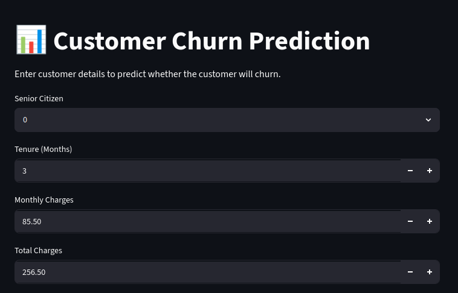
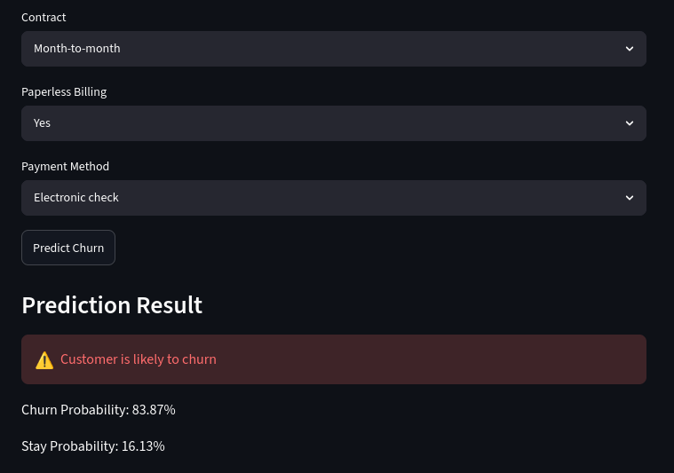

# 📊 Customer Churn Prediction Using Machine Learning

An end-to-end machine learning project that predicts whether a telecom customer is likely to churn based on customer demographics, services, and account information.

The project includes data preprocessing, exploratory data analysis, model training, evaluation, and deployment using a Streamlit web application.

---

## 🚀 Live Demo

(Add your Streamlit Cloud link here)

---

# 📌 Project Overview

Customer churn is a major challenge for subscription-based businesses. Predicting customers who are likely to leave helps companies take preventive actions and improve customer retention.

In this project, a machine learning classification model is developed to predict whether a customer will churn.

The model classifies customers into:

- **0 → Customer will stay**
- **1 → Customer will churn**

The trained model is deployed using Streamlit, allowing users to enter customer details and receive instant churn predictions.

---

# 🎯 Objectives

- Analyze customer data and identify churn patterns.
- Perform data cleaning and preprocessing.
- Compare different machine learning algorithms.
- Build an optimized classification model.
- Create an end-to-end machine learning pipeline.
- Deploy the model as an interactive web application.

---

# 📂 Dataset

The project uses the **Telco Customer Churn Dataset**.

The dataset contains information about:

## Customer Information

- Gender
- Senior Citizen status
- Partner
- Dependents

## Services Used

- Phone Service
- Multiple Lines
- Internet Service
- Online Security
- Online Backup
- Device Protection
- Tech Support
- Streaming Services

## Account Information

- Tenure
- Contract Type
- Payment Method
- Monthly Charges
- Total Charges

## Target Variable

`Churn`

- No → 0
- Yes → 1

---

# 🔍 Exploratory Data Analysis

Exploratory Data Analysis was performed to understand customer behavior and identify important churn factors.

Key observations:

- Customers with shorter tenure have a higher probability of churn.
- Month-to-month contracts have higher churn rates.
- Customers using electronic check payments show higher churn tendencies.
- Higher monthly charges are associated with increased churn probability.
- Long-term contracts reduce customer churn.

---

# 🛠️ Technologies Used

## Programming Language

- Python

## Libraries

- Pandas
- NumPy
- Matplotlib
- Seaborn
- Scikit-learn

## Deployment

- Streamlit

## Model Saving

- Joblib

---

# ⚙️ Machine Learning Workflow

```
Data Collection
        ↓
Data Cleaning
        ↓
Exploratory Data Analysis
        ↓
Feature Engineering
        ↓
Train-Test Split
        ↓
Preprocessing Pipeline
        ↓
Model Training
        ↓
Model Evaluation
        ↓
Deployment using Streamlit
```

---

# 🧹 Data Preprocessing

The following preprocessing steps were performed:

### Data Cleaning

- Removed unnecessary `customerID` column.
- Converted `TotalCharges` into numeric format.
- Removed missing values.

### Feature Processing

A Scikit-learn Pipeline was created using:

- `StandardScaler` for numerical features.
- `OneHotEncoder` for categorical features.

This ensures the same preprocessing steps are applied during training and prediction.

---

# 🤖 Models Tested

Different classification algorithms were evaluated:

| Model | Accuracy |
|------|----------|
| K-Nearest Neighbors | ~79% |
| Decision Tree | ~78% |
| Random Forest | ~80% |
| Logistic Regression | **80.45%** |

Logistic Regression was selected as the final model due to its performance and interpretability.

---

# 📈 Model Performance

## Logistic Regression

### Accuracy

```
80.45%
```

### Confusion Matrix

```
[[918 115]
 [160 214]]
```

### Classification Report

| Class | Precision | Recall | F1-score |
|------|-----------|--------|----------|
| No Churn | 0.85 | 0.89 | 0.87 |
| Churn | 0.65 | 0.57 | 0.61 |

### ROC-AUC Score

```
0.836
```

---

# 🖥️ Streamlit Application

The application allows users to:

- Enter customer details.
- Predict whether a customer is likely to churn.
- View churn probability and stay probability.

## Application Screenshots

### Input Interface



### Prediction Result



---

# 🏗️ Project Structure

```
Customer-Churn-Prediction/

│
├── data/
│   └── WA_Fn-UseC_-Telco-Customer-Churn.csv
│
├── models/
│   └── churn_pipeline.pkl
│
├── notebooks/
│   └── churn_analysis.ipynb
│
├── screenshots/
│   ├── app_input.png
│   └── prediction_result.png
│
├── app.py
├── train.py
├── requirements.txt
└── README.md
```

---

# 💻 Installation and Setup

## Clone Repository

```bash
git clone https://github.com/yourusername/customer-churn-prediction.git
```

Move into the project folder:

```bash
cd customer-churn-prediction
```

---

## Create Virtual Environment

```bash
python -m venv venv
```

Activate environment:

### Linux/Mac

```bash
source venv/bin/activate
```

### Windows

```bash
venv\Scripts\activate
```

---

## Install Dependencies

```bash
pip install -r requirements.txt
```

---

# ▶️ Running the Project

## Train the Model

```bash
python train.py
```

This will:

- Load the dataset.
- Perform preprocessing.
- Train the model.
- Evaluate performance.
- Save the trained pipeline.

---

## Run Streamlit Application

```bash
streamlit run app.py
```

The application will open in your browser.

---

# 👩‍💻 Author

**Swathi**

---

# ⭐ Acknowledgements

- Scikit-learn Documentation
- Streamlit Documentation
- Telco Customer Churn Dataset
